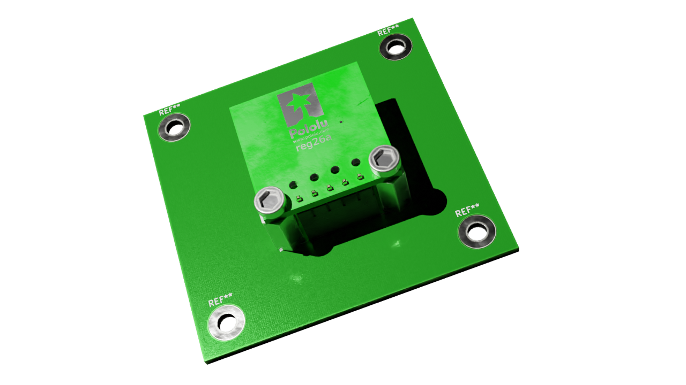

# template_project_kicad

## Init template

This template is based on **template_project_utils**:

https://github.com/twyleg/template_project_utils

Run the following commands to initialize the project:

    python -m venv venv
    source venv/bin/activate
    pip install -r requirements.txt

    template_projects_utils <NAME_OF_PROJECT>