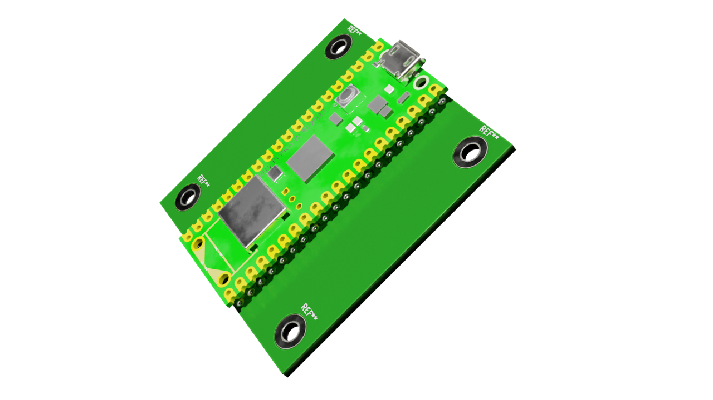

# template_project_kicad

https://twyleg.github.io/template_project_kicad

## Init template

This template is based on **template_project_utils**:

https://github.com/twyleg/template_project_utils

Run the following commands to initialize the project:

    source init.bash

    template_projects_utils <NAME_OF_PROJECT>
